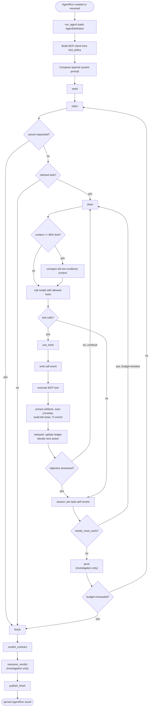

# ACI Architecture

ACI is a Django service that hosts the agent runtime, REST API, live
dashboard event stream, and MCP integration layer. The runtime is centered on a
shared queue-driven LangGraph graph for `triage` and `investigation`, plus a
package-based conversational orchestrator that owns analyst session state,
handoffs, and publication back into the dashboard/session record.

## Architectural Philosophy

ACI should evolve as a **thin deterministic harness around a strong general-purpose
reasoning core**. The runtime's job is to provide structure, durable state,
tooling, validation, and policy boundaries. The model's job is to interpret,
plan, prioritize, synthesize, and communicate. When the system fails, prefer
fixes that improve its general reasoning and reusable workflow rather than
patches that only handle one historical case.

### Core design principles

1. **Optimize for broad capability, not edge-case accumulation.**
   Treat each failure as evidence of a broader weakness in reasoning, workflow,
   tool affordances, or state handling. Prefer fixes that raise overall agent
   quality across many incidents over narrow logic that only addresses one
   manifestation.

2. **Improve prompts before adding orchestration code.**
   If the failure is about interpretation, planning, uncertainty handling,
   prioritization, or communication, first improve prompts and method. Add code
   only when the requirement is deterministic, cannot be expressed reliably in
   prompting, or must be enforced regardless of model quality.

3. **Favor methodology over prescriptions.**
   Prompt guidance should teach the model how to reason: identify assumptions,
   separate facts from inferences, anchor on evidence, explain uncertainty,
   verify field existence before filtering, and move from hypothesis to proof.
   Avoid large collections of instructions that hard-code "if X, do Y" unless
   the situation is fundamentally deterministic.

4. **Let graphs encode reusable reasoning workflows.**
   Graph complexity should come from broadly useful phases such as
   retrieve -> reason -> verify -> synthesize, not from branching on old
   failure anecdotes. A graph node should represent a durable workflow step,
   not a one-off behavioral correction unless that correction protects a
   general invariant.

5. **Let the LLM do semantic work.**
   Use the model for ambiguity resolution, planning, prioritization,
   summarization, contextual judgment, natural-language interpretation, and
   evidence synthesis. These are semantic tasks where rigid code tends to
   overfit.

6. **Let code do deterministic work.**
   Use traditional code for routing, validation, parsing, formatting,
   structured state transitions, retries, caching, persistence, API
   orchestration, budgets, cancellations, and capability exposure. Do not ask
   the model to perform tasks that algorithms can do exactly.

7. **Keep the agent layer platform-agnostic.**
   The agent's core prompts should describe reasoning method and workflow, not
   Wazuh-, TheHive-, or vendor-specific quirks. Backend-specific query syntax,
   field names, and tool semantics belong in MCP/provider guidance so new
   integrations can be added without rewriting agent cognition.

8. **Standardize MCP capabilities, not provider implementations.**
   Agents should reason in terms of stable capability roles such as
   `read_case`, `search_events`, `fetch_event`, `inspect_schema`,
   `profile_field_values`, `correlate_entity`, and `publish_case_report`.
   Each provider can map those roles onto its own tool names. This keeps the
   runtime portable and makes new MCP integrations easier to add.

9. **Separate capabilities from policy.**
   Core reasoning architecture should answer "how does the agent investigate
   well?" Policies should answer "what is allowed?", "when may it act?", and
   "what operational limits apply?" Authorization, safety constraints, and
   execution boundaries should remain separate from the reasoning loop whenever
   possible.

10. **Prefer simple, explainable architecture.**
    When multiple solutions exist, prefer the simpler design unless extra
    complexity yields substantial general benefit. Every new node, state field,
    prompt exception, or adapter must justify its ongoing maintenance cost.

### Practical decision order

When designing a fix or new feature, apply this order:

1. Is the problem primarily a reasoning or interpretation failure?
   Improve prompts and method first.
2. Is it a reusable workflow failure?
   Improve the graph or phase structure.
3. Is it a backend/tool-shape problem?
   Improve the MCP/provider contract.
4. Is it deterministic?
   Solve it in code.
5. Does the change generalize?
   If not, avoid it unless it protects correctness, safety, or durability.

### Structural implications for this repository

- `agent/runtime/` should remain a harness layer: orchestration entrypoints,
  graph assembly, state management, provider contracts, and deterministic
  runtime guarantees.
- Prompt layers should stay modular: identity, capabilities, methodology,
  run-context, and provider guidance should remain conceptually separate.
- MCP-specific prompt content should live with the MCP server or provider, not
  inside the platform-agnostic agent prompt.
- Entry-point files should live higher in the tree, while specialized helpers,
  transforms, validators, and implementation details should live deeper in the
  package hierarchy.

In short: **favor general intelligence over special-case handling, prompt
improvements over orchestration changes, semantic reasoning in the LLM,
deterministic computation in code, standardized MCP capability contracts over
backend-specific coupling, and simpler architectures over accumulating
guardrail machinery.**

## Runtime Entry

An agent run starts through either the REST API, dashboard orchestrator, CLI, or
workflow command. All specialist run paths converge on
`agent.runtime.engine.run.run_agent`, which:

1. loads the registered `AgentDefinition` by `agent_name`;
2. applies any DB-backed `AgentConfig` overrides;
3. marks the `AgentRun` as `running`;
4. builds an MCP client from the agent's deny-by-default `tool_policy`;
5. loads MCP prompt guidance and tool schemas;
6. builds the OpenAI-compatible model client;
7. composes the platform and agent prompt layers;
8. invokes the compiled LangGraph graph with an `AgentState`.

The graph returns a final state with `status` and `final_answer`, which is then
persisted back to `AgentRun`.

The stable high-level runtime entry surfaces are:

- `run_orchestrator`
- `OrchestratorSession`
- `dispatch_run`
- `run_agent`
- `build_mcp_client`
- `compose_system_prompt`

The canonical orchestrator import surface is the package
`agent.runtime.orchestrator`. The historical flat module
`agent.runtime.orchestrator.py` remains only as a compatibility shim.

Model calls intentionally have no client-side request timeout by default. Local
vLLM/Ollama turns can run for a long time during tool-heavy investigations, so
`LLM_TIMEOUT` and `ModelProviderConfig.timeout` are opt-in positive-second
deadlines. Blank or `0` disables the timeout.

## Agent Registry

Agents are registered in `agent/agents/registry.py` using `AgentDefinition`
(`agent/agents/base.py`). Three agents are registered:

| Agent | Role | Tool Policy | Budget | Orchestrator-routable |
|---|---|---|---|---|
| `triage` | Reads SOAR case context, checks nearby SIEM evidence and memory, assesses severity/category, and returns a triage report with a prioritized investigation plan. | `aci-thehive`, `aci-wazuh`, `aci-taskqueue`, `aci-memory`, `avfs` | 12 steps, 18 tool calls | yes |
| `investigation` | Performs deeper SIEM-backed investigation, enriches artifacts, uses the findings board and memory, and produces a grounded final report. | `aci-thehive`, `aci-wazuh`, `aci-taskqueue`, `aci-board`, `aci-memory`, `avfs` | 40 steps, 60 tool calls | yes |
| `seeder` | Internal-only. Parses a completed triage report and populates the investigation task queue (see [Seeder Agent](#seeder-agent)). Never appears in orchestrator routing. | `aci-taskqueue` | 20 steps, 25 tool calls | no |

`triage` is marked as `produces_handoff`; `investigation` is marked as
`consumes_handoff`. The orchestrator uses those flags to pass structured
`Handoff` data through `AgentRun.metadata` instead of relying on prompt-string
parsing. `seeder` is invoked directly by the investigation agent's `seed`
node, not by the orchestrator.

## Prompt Composition

Prompt composition is intentionally layered:

- platform-agnostic agent identity, capabilities, and reasoning method live in
  `agent/prompts/`;
- runtime context assembly lives in `agent.runtime.config.prompts` and
  `agent.runtime.config.prompt_sections`;
- provider capability contracts are rendered separately from core reasoning
  instructions;
- MCP-specific tool semantics come from MCP server prompts, not from the core
  agent prompt;
- orchestrator-specific prompt behavior lives under
  `agent.runtime.orchestrator/`.

The run-context composer keeps these responsibilities separate:

- run metadata and budgets;
- tool availability;
- provider capability contracts;
- orchestrator handoff/session context;
- restart/resume inherited context;
- MCP guidance;
- preserved analyst conversation.

This boundary keeps the agent prompt portable while allowing provider-specific
guidance to evolve independently.

### Role altitude ladder

The assembled prompt is organized as an altitude ladder of headed sections, carried
entirely inside the standard LangChain message types (no provider-specific "developer"
role) so it runs identically on the self-hosted OpenAI-compatible endpoint:

- The `SystemMessage` (`compose_system_prompt`) opens with a `# SYSTEM` section
  (immutable identity / safety / tool behavior — the `platform` layer) followed by a
  `# DEVELOPER` section (per-agent workflow and methodology — the remaining layers).
- Each node's `HumanMessage` carries a `# USER` section (the current task) followed by
  a `# CONTEXT` section (live board/queue state and evidence).

The section headers are plain text, so the four-part structure is provider-agnostic:
it degrades to ordinary prompt text on any `ChatModel` while giving a stronger model a
clear identity/method/task/state separation.

## Agent Graph

The graph is built from the package under `agent/runtime/graph/`. The package
re-exports historical names through `agent.runtime.graph` (a dynamic re-export in
`__init__.py`), but implementation is split across narrower modules, each owning one
concern:

| Module | Owns |
|---|---|
| `builder` | Assembles the `StateGraph`: registers nodes and the conditional routing between them. |
| `state` | The `AgentState` typed dict threaded through every node. |
| `nodes_loop` | The per-task tool loop nodes: `seed`, `claim`, `think`, `use_tools`, plus post-tool enrichment (correlation, kill-chain, TI). |
| `interpretation/` | The `interpret` node, split into `ledger` (durable per-task memory), `pivots` (candidate scoring/selection), `decisions` (next-action logic), `prompt` (model-call rendering), and `node` (the node + glue). |
| `nodes_flow/` | The post-task nodes, split into `assess` (self-review + synthesis), `pivot` (board + lead follow-ups), and `completion` (`finish`, verdict contract, reassessment, publication), over a shared helper module. |
| `observation` | Deterministic normalization of a tool-result batch into observation state (signals, snapshots, pivot candidates). |
| `toolio` | Tool execution plumbing, result capping, and task-queue calls. |
| `validation` | Report/board validation, escalation facts, and board compromise-indicator surfacing. |
| `synthesis` / `publication` | Investigation-summary building and durable final-output writing. |
| `reflection` / `findings_model` / `lead_model` | Model-driven per-task review, findings verification, and lead validation. |
| `parsing` / `sanitize` / `timeutil` / `board` / `leads` | Shared leaf helpers: markdown/regex parsing, history sanitization, time/pivot utilities, board context, lead queueing. |

The active top-level graph stages are:

| Node | Responsibility |
|---|---|
| `seed` | Ensure the agent has initial queue work. Triage creates one triage task. Investigation calls the `seeder` agent for a normal triage handoff, or creates a resume/fallback task directly, only when its queue has no pending work (see [Seeder Agent](#seeder-agent)). |
| `claim` | Stop if cancellation was requested; otherwise atomically claim the highest-priority pending task from `aci-taskqueue`. |
| `think` | Build or continue the model conversation for the current task, compact context when the prompt approaches 80% of the model provider's configured context length (Settings → Model provider), and call the model with allowed MCP tools. There is no separate pre-tool "intent" stage in this graph — that streamed public-reasoning mechanism is orchestrator-only (see [Orchestrator And Session Publication](#orchestrator-and-session-publication)). |
| `use_tools` | Execute model-requested tools, cap oversized tool results before feeding them back to the model, expand AVFS `~` paths, deterministically extract artifacts (including decoded hex/base64/URL-encoded payloads) from event-shaped JSON, auto-correlate confirmed entities, build the kill-chain view, and trigger TI enrichment. |
| `interpret` | Mandatory post-tool reasoning checkpoint (`agent/runtime/graph/interpretation/`). Runs after every tool batch: normalizes the batch into an observation, updates the durable per-task ledger (confirmed findings, hypothesis, query-trial memory, pivots), surfaces board compromise indicators the model must disposition, and decides continue-vs-assess against the task's success criteria. Routes back to `think` to continue the task or forward to `assess` when the objective is answered. |
| `assess` | Complete the claimed task with a summary. For `investigation`, runs the [per-task self-review](#per-task-self-review) (`agent/runtime/graph/reflection.py`) before allowing completion — a single model-driven review that can route back to `think` with one consolidated `needs_more_work` correction instead of a fixed cascade of separate guards. |
| `pivot` | Investigation-only evidence-to-follow-up phase: pushes confirmed `## Findings` into the Findings Board (gated by the self-review's grounding/novelty verdicts), checks confirmed compromise artifacts on the board for an unposted escalation, validates `## New Leads` (model-assisted, deduplicated against the existing queue), and queues approved follow-up tasks. |
| `finish` | Finalize the run and compute `completed` vs `incomplete_budget`, or preserve `cancelled`. |
| `verdict_contract` | Generates or repairs the canonical fenced-JSON diagnosis verdict block from the final report. |
| `reassess_verdict` | **Investigation only.** Compares triage and investigation verdicts and resolves conflicts with a focused model call only when needed. |
| `publish_finish` | Writes durable final outputs such as `final.md` and posts the report to the SOAR case. |



## Queue Semantics

`aci-taskqueue` is the execution authority. The graph never decides which task is
next locally; it calls `claim_next`, which uses a SQLite `BEGIN IMMEDIATE`
transaction to claim the highest-priority pending task across MCP subprocesses.

Human edits are hard state changes. Queue API writes update the same task store
that agents claim from, so an analyst priority change or dismissal affects the
next claim boundary.

Completion is queue-driven. A model response does not finish a run by itself; it
only completes the current task. The graph returns to `claim` until the queue is
empty, cancellation is requested, or step/tool-call budgets are exhausted.

### Task Completion Contract

Every task stored with status `completed` must have a non-empty summary. When the
action model ends a task without text, `assess` performs one text-only recovery
call using the task conversation and tool results. The recovery prompt requires:

- work performed;
- key result or outcome;
- remaining uncertainty or blockers;
- relevant artifact paths or native event IDs.

If recovery also returns no text or fails, the runtime writes a deterministic
execution record derived from actual `ToolMessage` history. If there was no tool
activity, the record explicitly says that no findings or conclusion were
supplied. The taskqueue repository rejects direct blank completion summaries.

Investigation finalization reads these task summaries into the structured run
result, so the orchestrator can distinguish completed work, incomplete work, and
tasks that completed without a substantive conclusion.

### Per-Task Self-Review

Older revisions enforced task quality with a fixed cascade of separate guard
nodes (a triage-SIEM-query guard, an investigation-SIEM-query guard, a
broad-query guard, a depth guard, a summary-format guard, and an
incomplete-pivot guard), each hand-coding one failure mode as a Python
`if`-branch with its own retry counter. Per the design philosophy's
"prefer prompts and reusable workflow over edge-case branching", this was
replaced with a single **per-task self-review** (`agent/runtime/graph/reflection.py:
review_task_model`): one model call that judges the task holistically and
returns a `TaskReview` (`conclude` or `keep_working`, plus per-`## Findings`
bullet grounding/novelty verdicts).

The review is given deterministic *signals* to ground its judgment, computed in
code rather than guessed by the model:

- `evidence_queries` — count of genuine evidence-retrieval tool calls this task;
- `hit_count` / `hit_ceiling` — whether the most recent search result is at or
  near the unusable result ceiling;
- `unpivoted_iocs` — confirmed network indicators with no corresponding
  `## New Leads` pivot;
- `unqueried_clusters` — `get_event_volume` post-peak activity windows that
  were profiled but never followed up with a raw query;
- `unreported_compromise_artifacts` — confirmed compromise indicators already
  on the Findings Board (e.g. a decoded reverse-shell command) that are not
  yet reflected in this task's `## Findings`.

`assess` re-injects the review's feedback as one consolidated correction and
sets `status="needs_more_work"`, which `_route_assess` (`graph/builder.py`)
routes back to `think` if budget remains. `reflection_retries` bounds the
loop (default 2 retries); a **convergence guard**
(`reflection_evidence_at_last_nudge`) suppresses a further nudge if the prior
correction produced no new evidence query, so a task cannot churn forever on
orientation-only turns. The review is fail-open: if the model is unavailable
or the call fails, the task falls back to the deterministic non-empty-summary
check below and completes rather than stalling the run.

### Seeder Agent

A normal triage-handoff seed (i.e. not a resume) populates the investigation
queue through the dedicated `seeder` agent (`agent/runtime/engine/seeder_runner.py:
run_seeder`) instead of asking the investigation model to call `create_task`
directly. Seeding is two-phase:

1. **Deterministic extraction.** Plan items are parsed straight out of the
   triage report's `## Investigation Plan` and written with direct
   `create_task` calls — no model involvement. This guarantees exactly one
   task per plan item regardless of model behavior, which is what the old
   "seed guard" used to have to re-prompt for.
2. **Model pass for gaps.** A bounded second pass lets the model add tasks the
   plan may have omitted (e.g. an explicit C2-destination pivot or
   initial-access-vector task) and verify completeness via `list_tasks`.
   Every `create_task` call in this pass — direct or model-proposed — is
   checked against a **deterministic dedup backstop**
   (`agent/runtime/graph/leads.py: duplicate_existing_task`, the same matcher
   the pivot node's lead validator uses) before it is executed, so the model
   cannot queue two near-identical tasks in the same seeding pass.

`seeder` is `orchestrator_routable=False`: it never appears in orchestrator
routing and is only ever invoked from `seed`.

## Live Model Streaming

Model calls use LangChain streaming when the provider supports `astream`.
`agent.runtime.streaming.invoke_streaming` emits each provider text delta as a
`stream` event while accumulating the final `AIMessageChunk` so existing
tool-call and assessment logic still receives a normal final model message.

Transient deltas bypass the `AgentEvent` database writer. The runner appends them
to a thread-safe per-session buffer, and `RunConsumer` drains that buffer every
50 ms from the ASGI event loop before forwarding the deltas over WebSocket.

`static/dashboard/app.js` merges consecutive stream deltas from the same
source/run into a single live assistant bubble. When the orchestrator emits the
final persisted `answer` event, the browser finalizes that bubble instead of
rendering a duplicate answer.

Tool-call chunks are preserved by LangChain chunk addition. Chunks without text
still contribute to the accumulated final message but do not create visible
stream events.

## Public Reasoning Before Tools (Orchestrator)

This mechanism lives in `agent/runtime/analysis/intent.py`
(`generate_public_intent`) and is consumed only by the orchestrator's own
turn loop (`agent/runtime/orchestrator/driver.py`) — **not** by the `triage`
or `investigation` LangGraph nodes, which call the tool-bound model directly
from `think` with no separate pre-tool intent phase.

Each orchestrator turn that may call a tool is two-phase:

1. `generate_public_intent` calls an unbound text model and requests a
   state-grounded public progress summary.
2. Each provider delta is emitted as transient `intent_delta`.
3. The accumulated statement is persisted as a durable `intent` event.
4. The orchestrator calls the tool-bound model and, if it requests tools,
   emits `call` and then invokes them.

The event ordering contract is:

```text
intent_delta... -> intent -> call -> result
```

This sequence applies when the intent model returns text. With an empty or failed
intent request, execution continues as `call -> result` with no replacement event.

The streamed narrative is free-form Markdown. It explains relevant established
state, the current interpretation, uncertainty or blockers, and the intended next
action. It may use short paragraphs, bullets, emphasis, inline code, or brief
headings, but follows no fixed schema.

This provides the operational information normally sought from visible
"thinking aloud" without exposing private chain-of-thought. Prompts prohibit
token-level reasoning, exhaustive step-by-step internal deliberation, predicted
results, and unsupported claims. The next action may invoke a capability,
produce output, request information, wait, stop, or otherwise advance or
conclude the objective. If generation is empty, unsupported, or fails, no
synthetic intent is emitted and execution continues to the action model.

Cancellation is checked after intent generation and before execution. An analyst
can therefore stop a run after seeing its intended action without allowing the
announced tool to run.

The dashboard maintains separate stream state for final orchestrator answers and
public reasoning narratives. Markdown is rendered as deltas arrive in real
time and is also rendered from the durable event after reload. Completed
narratives are durable; partial deltas are intentionally not replayed.

Guaranteed intent adds one text-only model request per orchestrator
tool-capable turn. This increases latency and model usage in exchange for
strict visibility before side effects.

## Orchestrator And Session Publication

The orchestrator is a separate package runtime under
`agent/runtime/orchestrator/` with dedicated `messages`, `session`, `tools`,
`prompts`, and `driver` modules. It is responsible for analyst conversation
state, specialist routing, and durable analyst-visible transcript updates.

Specialist completion is normalized through one publication path:

- orchestrator-triggered specialist completion updates the shared
  `OrchestratorSession`;
- direct resume and restart paths republish through
  `agent.dashboard.runner.session_state.publish_specialist_result_to_session`;
- shared session mutation logic lives in
  `agent.runtime.orchestrator.specialist_sync`.

This keeps analyst-visible session state, verdict propagation, and resumed
specialist reports aligned regardless of whether the specialist finished through
the orchestrator tool loop or a direct continuation endpoint.

## MCP And Tool Policy

MCP tools are deny-by-default through each agent's `tool_policy`.

Built-in providers live under `agent/runtime/providers/` and resolve settings
through the provider config resolver. Additional MCP servers can be registered
through `MCPServerConfig` without editing the graph or runner. At run start, the
runtime injects `ACI_CASE_ID`, `ACI_RUN_ID`, and `ACI_AGENT_NAME` into configured
stdio MCP environments so queue-scoped servers can enforce platform-owned
identity.

### Standardized provider capability contract

Agents should reason about provider access through stable capability roles, not
by assuming one vendor's tool names. Built-in providers therefore declare a
capability map from a standardized role to one or more concrete MCP tools.

- Every `siem` provider must expose:
  `search_events`, `fetch_event`, `inspect_schema`, `profile_field_values`
- Every `soar` provider must expose:
  `read_case`, `list_case_alerts`, `read_alert`, `publish_case_report`
- Utility and filesystem providers can also advertise standardized roles such
  as queue writes, board writes, memory lookup, and workspace read/write.
- Providers also declare whether MCP instructions are required before their
  tools may be exposed for a run.

This keeps agent prompts vendor-neutral while still letting each MCP server
publish exact tool names, query syntax, and platform-specific usage rules in its
own MCP prompt guidance.

The graph applies one extra policy rule: `triage` does not expose `create_task`
to the model. Triage returns a report and proposed plan; the orchestrator decides
whether to start investigation, and the investigation agent converts the handoff
into its own queue work.

### SIEM Query Robustness (Wazuh)

`aci-mcp-servers/aci-wazuh/aci_wazuh/client.py` (`WazuhClient`) adds
deterministic guards around model-constructed query DSL, surfaced back to the
model as a `hint`/`note` on the tool result rather than failing silently:

- **Malformed-query hints.** `_query_error_hint` maps a known Elasticsearch
  parse failure (e.g. a `should` clause nested incorrectly) to one actionable
  correction instead of a raw stack trace.
- **Timestamp-in-keyword stripping.** `_strip_temporal_tokens` removes
  ISO-8601 tokens a model mistakenly placed inside `search_keyword` terms
  (timestamps belong in `time_range`); leaving them in forces the
  any-term fallback to match almost the whole index.
- **`should`-without-`must` detection.** `_has_noop_should` recursively
  scans a `bool` query for a `should` clause with no `must` and no
  `minimum_should_match`. Under Elasticsearch/OpenSearch defaults this shape
  is **scoring-only** — the query silently matches everything else in scope
  (commonly just the time-range `filter`) instead of being narrowed by the
  `should` terms. This is the most common way a query that *looks* narrow
  returns the whole window; `search()` attaches a `note` explaining the fix
  whenever it fires.

**Agent-name is not a guaranteed-unique identity.** A Wazuh `agent.name`
display label can be shared by multiple distinct monitored hosts (verified
live: 13 distinct `agent.id`/`agent.ip` values shared one `agent.name` in a
production dataset). Investigation and platform prompt guidance teach
verifying cardinality via `profile_field("agent.id", ...)` before treating
events scoped only by `agent.name` as one host's activity — the same
"confirm a field/value exists before filtering" methodology extended to
"confirm a grouping key is actually unique before merging by it."

## Findings Board

`aci-board` stores per-run Findings Board entries. The original three
structural kinds (model-populated) have been joined by four deterministic,
backend-populated kinds added by the `use_tools` enrichment pipeline:

| Kind | Meaning | Population |
|---|---|---|
| `artifact` | A normalized entity observed in a retrieved native event, including a payload decoded from hex/base64/URL-encoding. | Deterministic extraction (`agent/runtime/analysis/artifacts.py`) after every successful investigation tool result. |
| `fact` | A confirmed, evidence-backed finding. | Structural parsing of `## Findings`, gated by the [per-task self-review](#per-task-self-review)'s grounded/novel verdicts — only bullets the review confirms are new and event-cited become facts. |
| `hypothesis` | An explanation or lead requiring confirmation or refutation. | Structural parsing of `## Hypotheses`, triage handoff hypotheses, and generated leads. |
| `correlation` | A confirmed entity's co-occurring neighborhood (other entities, fields, sample event IDs). | Deterministic, automatic — `_auto_correlate_entities` fires `correlate_entity` for newly confirmed high-value entities without a model call. |
| `kill_chain` | The MITRE ATT&CK tactic/technique coverage observed so far, plus detected gaps. | Deterministic, automatic — `_build_kill_chain` (`agent/runtime/analysis/kill_chain.py`) fires `correlate_techniques` and can queue gap-coverage follow-up tasks. |
| `query_memo` | A record of a SIEM query shape that returned an unusably broad/truncated result. | Deterministic — `agent/runtime/analysis/query_memo.py`, so later tasks see it and avoid reissuing the same broad shape. |
| `ti_result` | Threat-intelligence enrichment for a confirmed artifact (e.g. VirusTotal verdict). | Deterministic, async, rate-limited (`agent/ti/enricher.py`); optional, only when a TI provider is configured. |

Artifact extraction does not ask the model to recognize entities and does not
invoke a board MCP tool. Only allow-listed event fields are accepted. Nested
Elasticsearch/Wazuh shapes are flattened, values are validated and normalized,
and entries retain the native event ID as their source. Recognized types
include event IDs, IPs, MD5/SHA1/SHA256 hashes, domains, hosts, users,
processes, file paths, and **decoded commands** — long hex/base64/URL-encoded
tokens are decoded and re-scanned for compromise-indicator patterns (e.g. a
reverse-shell one-liner hidden in a base64 URL parameter), independent of
whether the agent itself thought to decode the value.

Before each non-seed investigation task, the graph injects the full Findings
Board into model context:

- artifacts are proposed as pivots, and decoded-command artifacts are
  retrieved evidence the agent must surface, not re-derive;
- facts are treated as established unless newer evidence contradicts them;
- hypotheses must be tested, refined, confirmed, refuted, or left explicitly
  unresolved.

**Board-driven compromise detection.** The `interpret` must-disposition block,
escalation (an immediate case comment when active compromise is confirmed), and
the per-task self-review's `unreported_compromise_artifacts` signal all read
compromise-relevant evidence directly off the board (`agent/runtime/graph/
validation.py: _board_compromise_facts`), not only from the agent's own
narrative. Two deterministic triggers surface an entry: a narrative reverse-shell /
C2 indicator, **or** any command the decode layer recovered from an encoded field
(marked `[decoded]`/`[hex-decoded]`). The decode marker is technique-agnostic on
purpose — a `mysql ... select * from wp_users` credential dump or an offline
password-cracker invocation is surfaced the same as a `/dev/tcp/...` reverse shell;
the code only asserts "an attacker hid a command here, account for it," and the
model classifies the kill-chain phase in context (it has the full board). Decoded
commands are ranked ahead of narrative matches so the deterministic ground truth is
never crowded out of the interpret block's cap. This closes a gap where the decode
layer had already extracted a confirmed indicator but the agent's literal-string
search for it came back empty and it recorded a false negative — the board's own
decoded artifact is now authoritative regardless of what the agent wrote.

The final investigation summary includes the structural categories before task
summaries. This lets the orchestrator understand both accumulated knowledge and
the state of unresolved reasoning across the run.

## AVFS Workspace Indexing

AVFS is the durable workspace for case artifacts, evidence, findings, reports,
and memory. Successful AVFS writes trigger `agent.workspace.avfs_writer`, which
updates:

- the nearest directory's `memory.md`;
- concise parent `memory.md` indexes up to the case, run, or memory root.

Each `memory.md` contains:

- `# Memory`
- `## Purpose`
- `## Files`
- `## Child Directories`
- `## Notes`

Parent indexes summarize child directories rather than duplicating every nested
artifact. This keeps AVFS browsable for future agents and analysts while raw
payloads remain stored once under stable paths.

## Status And Failure Handling

The runtime persists one of the fixed `AgentRun` statuses:

| Status | Meaning |
|---|---|
| `created` | Run row exists but has not been queued. |
| `queued` | Run accepted and worker/thread dispatch requested. |
| `running` | Graph execution is active. |
| `waiting` | Reserved for future human/external waits. |
| `completed` | Queue emptied and finalization succeeded. |
| `incomplete_budget` | Step or tool-call budget exhausted before normal completion. |
| `cancelled` | Cancellation was requested and honored at a claim boundary. |
| `blocked` | Reserved for no executable work or external dependency blocking. |
| `failed` | Runtime or tool setup raised an unrecoverable exception. |

Known vLLM harmony-control-token leakage is handled by sanitizing assistant
messages before they re-enter history. If vLLM still reports an unexpected
message-header parse failure, `think` retries once with more aggressive history
sanitization.

## Workflows And Webhooks

Automatic workflows exist, but are globally disabled by default and gated by
runtime settings plus per-trigger enablement.

Supported bindings:

- `new_case` -> `triage`
- `new_alert` -> `triage`

Configured triggers expose:

```text
POST /api/agent/webhooks/<trigger_id>/
```

The compatibility endpoint remains:

```text
POST /api/agent/webhooks/thehive/
```

## Configuration Reference

### Core Settings

| Variable | Default | Description |
|----------|---------|-------------|
| `SECRET_KEY` | Required | Django secret key (auto-generated) |
| `WORKFLOWS_ENABLED` | `false` | Fallback global workflow enable switch when DB runtime config is unset |

Model provider settings are primarily DB-backed through `ModelProviderConfig`
via Dashboard -> Settings. `.env` is now mainly bootstrap and fallback config.

### SIEM Integration (Wazuh)

| Variable | Default | Description |
|----------|---------|-------------|
| `WAZUH_URL` | Required | Wazuh API endpoint (https://...:9201) |
| `WAZUH_USER` | Required | Wazuh admin username |
| `WAZUH_PASSWORD` | Required | Wazuh admin password |
| `WAZUH_VERIFY_TLS` | `true` | Verify SSL certificates |

### SOAR Integration (TheHive)

| Variable | Default | Description |
|----------|---------|-------------|
| `THEHIVE_HOST` | Required | TheHive API host |
| `THEHIVE_PORT` | 9000 | TheHive API port |
| `THEHIVE_API_KEY` | Required | TheHive API key |

### Workspace (AVFS)

| Variable | Default | Description |
|----------|---------|-------------|
| `AVFS_URL` | `http://127.0.0.1:8765/` | AVFS HTTP endpoint |
| `AVFS_AUTH_TOKEN` | Required | AVFS authentication token (NOT `change-me-avfs-token`) |
| `AVFS_AGENT_ID` | `agent_1` | Agent workspace identifier |

### Database

| Variable | Default | Description |
|----------|---------|-------------|
| `TASKQUEUE_DB_PATH` | `taskqueue.db` | Task queue SQLite database path |
| `BOARD_DB_PATH` | `board.db` | Findings board SQLite database path |
| `TI_CACHE_DB_PATH` | `ti_cache.db` | Threat-intelligence cache SQLite database path |

## API Reference

### Agent Runs

#### Start a run
```
POST /api/agent/runs/
Authorization: Bearer <token>
Content-Type: application/json

{
  "agent_name": "investigation",
  "case_id": "~254202040",
  "question": "What happened?"
}

Response: { "run_id": "...", "status": "queued" }
```

#### Get run status
```
GET /api/agent/runs/<run_id>/
Authorization: Bearer <token>

Response: {
  "run_id": "...",
  "status": "completed",
  "result": "...",
  "error": null
}
```

#### Get run events
```
GET /api/agent/runs/<run_id>/events/
Authorization: Bearer <token>

Response: [
  { "id": 1, "kind": "note", "source": "orchestrator", "summary": "..." },
  ...
]
```

#### Cancel a run
```
POST /api/agent/runs/<run_id>/cancel/
Authorization: Bearer <token>
```

#### Resume a run
```
POST /api/agent/runs/<run_id>/resume/
Authorization: Bearer <token>
```

When the resumed run belongs to an interactive orchestrator session, completion
is republished into analyst-visible session state through the same specialist
publication path used by orchestrator-triggered completions and restarts.

### Task Queue

```
GET    /api/agent/cases/<case_id>/queues/<agent_name>/tasks/?run_id=<run_id>
POST   /api/agent/cases/<case_id>/queues/<agent_name>/tasks/
PATCH  /api/agent/cases/<case_id>/queues/<agent_name>/tasks/<task_id>/
DELETE /api/agent/cases/<case_id>/queues/<agent_name>/tasks/<task_id>/
```

### Workspace & Reports

```
GET /api/agent/cases/<case_id>/workspace/
GET /api/agent/cases/<case_id>/reports/latest/
```

## Troubleshooting

| Symptom | Fix |
|---------|-----|
| `ModuleNotFoundError: No module named 'aci_taskqueue'` | `pip install -e aci-mcp-servers/aci-taskqueue` |
| `RuntimeError: Failed to load MCP instructions for aci-wazuh` | Wazuh is unreachable or `WAZUH_URL`/`WAZUH_PASSWORD` is wrong |
| `grep_semantic failed: {ok: false, error: ...}` | AVFS container not running or `AVFS_AUTH_TOKEN` is the literal `change-me-avfs-token` |
| `add_case_comment` 404 from TheHive | Tool was removed; old sessions may have fired this. New runs use `post_case_report` only |
| `parsing_exception: Unknown key for START_OBJECT in [time_range]` from Wazuh | Model double-wrapped the search request. The client auto-unwraps this |
| Search result has a `note` about `should` being "SCORING-ONLY" | The query's `should` clause has no `must`/`minimum_should_match`, so it did not actually filter — see [SIEM Query Robustness](#siem-query-robustness-wazuh) |
| Investigation results from one `agent.name` look inconsistent across runs | `agent.name` may not be unique in this index — check `agent.id` cardinality before trusting a name-scoped query as one host |
| Django migration errors on startup | Run `python manage.py migrate` |
| Empty investigation report | Local LLM may be too small or out of context; use a 13B+ model |

## Development

### Debug scripts

Local inspection scripts are in `scripts/dev/`:

```bash
python scripts/dev/inspect_events.py --session <id> --latest 30
python scripts/dev/poll.py --session <session_id>
python scripts/dev/submit.py --question "Triage case ~247152824" --poll
```

### Making changes

1. Create a feature branch
2. Update tests if needed (`tests/unit/`, `tests/django/`)
3. Run the offline test suite to verify no regressions:
   ```bash
   PYTHONPATH=. python -m pytest tests/unit tests/django -q
   ```
4. Commit with a clear message
