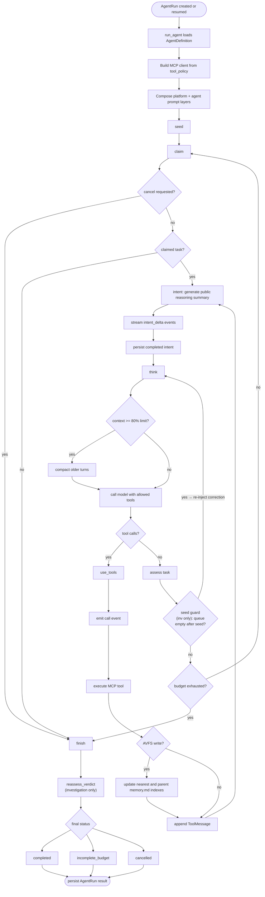

# ACI Architecture

ACI is a Django service that hosts the agent runtime, REST API, live
dashboard event stream, and MCP integration layer. The runtime is centered on a
single queue-driven LangGraph graph shared by the `triage` and `investigation`
agents.

## Runtime Entry

An agent run starts through either the REST API, dashboard orchestrator, CLI, or
workflow command. All paths converge on `agent.runtime.run.run_agent`, which:

1. loads the registered `AgentDefinition` by `agent_name`;
2. marks the `AgentRun` as `running`;
3. builds an MCP client from the agent's deny-by-default `tool_policy`;
4. loads MCP prompt guidance and tool schemas;
5. builds the OpenAI-compatible model client;
6. composes the platform and agent prompt layers;
7. invokes the compiled LangGraph graph with an `AgentState`.

The graph returns a final state with `status` and `final_answer`, which is then
persisted back to `AgentRun`.

Model calls intentionally have no client-side request timeout by default. Local
vLLM/Ollama turns can run for a long time during tool-heavy investigations, so
`LLM_TIMEOUT` and `ModelProviderConfig.timeout` are opt-in positive-second
deadlines. Blank or `0` disables the timeout.

## Agent Registry

Agents are registered in `agent/agents/registry.py` using `AgentDefinition`.
The current routable agents are:

| Agent | Role | Tool Policy | Budget |
|---|---|---|---|
| `triage` | Reads TheHive case context, assesses severity/category, and returns a triage report with a prioritized investigation plan. | `aci-thehive`, `aci-taskqueue`, `avfs` | 20 steps, 40 tool calls |
| `investigation` | Runs deeper SIEM-backed investigation, writes evidence/findings to AVFS, and produces a final report pointer. | `aci-thehive`, `aci-wazuh`, `aci-taskqueue`, `avfs` | 100 steps, 100 tool calls |

`triage` is marked as `produces_handoff`; `investigation` is marked as
`consumes_handoff`. The orchestrator uses those flags to pass structured
`Handoff` data through `AgentRun.metadata` instead of relying on prompt-string
parsing.

## Agent Graph

The graph is built in `agent/runtime/graph.py` with these nodes:

| Node | Responsibility |
|---|---|
| `seed` | Ensure the agent has initial queue work. Triage creates one triage task. Investigation creates a handoff or fallback task only when its queue has no pending work. |
| `claim` | Stop if cancellation was requested; otherwise atomically claim the highest-priority pending task from `aci-taskqueue`. |
| `intent` | Call the model without tools, stream a free-form public reasoning narrative in Markdown, and persist it before any tool-capable model call. |
| `think` | Build or continue the model conversation for the current task, compact context when the prompt approaches 80% of the model provider's configured context length (Settings → Model provider), and call the model with allowed MCP tools. |
| `use_tools` | Execute model-requested tools, cap oversized tool results before feeding them back to the model, pre-create AVFS parent directories for writes, and update `memory.md` indexes after successful AVFS writes. |
| `assess` | Complete the claimed task with a summary. Triage has a fallback recovery prompt when the model stops without returning report text. Investigation has a **seed guard**: if the "Populate investigation queue" seed task finishes without any `create_task` calls, `assess` re-injects a correction message and routes back to `think` instead of forwarding to `pivot`, giving the model another chance to populate the queue. |
| `finish` | Write the final investigation report stub through the AVFS workspace writer, compute `completed` vs `incomplete_budget`, or preserve `cancelled`. |
| `reassess_verdict` | **Investigation only.** Runs after `finish`. Extracts the triage verdict from the handoff and compares it against the investigation synthesis verdict. If they agree, tags `state["verdict"]` with `triage_verdict` at zero cost. If they conflict, fires one focused model call — given the full investigation narrative plus both verdicts — to resolve which is correct, then overwrites `state["verdict"]` with the resolved result. The resolved verdict carries `triage_verdict` (the original triage call) and `reassessment_reason` (one-sentence explanation). If no model is available or the call fails, synthesis verdict is preserved and tagged. |



## Queue Semantics

`aci-taskqueue` is the execution authority. The graph never decides which task is
next locally; it calls `claim_next`, which uses a SQLite `BEGIN IMMEDIATE`
transaction to claim the highest-priority pending task across MCP subprocesses.

Human edits are hard state changes. Queue API writes update the same task store
that agents claim from, so an analyst priority change or dismissal affects the
next claim boundary.

Completion is queue-driven. A model response does not finish a run by itself; it
only completes the current task. The graph returns to `claim` until the queue is
empty, cancellation is requested, or step/tool-call budgets are exhausted.

### Task Completion Contract

Every task stored with status `completed` must have a non-empty summary. When the
action model ends a task without text, `assess` performs one text-only recovery
call using the task conversation and tool results. The recovery prompt requires:

- work performed;
- key result or outcome;
- remaining uncertainty or blockers;
- relevant artifact paths or native event IDs.

If recovery also returns no text or fails, the runtime writes a deterministic
execution record derived from actual `ToolMessage` history. If there was no tool
activity, the record explicitly says that no findings or conclusion were
supplied. The taskqueue repository rejects direct blank completion summaries.

Investigation finalization reads these task summaries into the structured run
result, so the orchestrator can distinguish completed work, incomplete work, and
tasks that completed without a substantive conclusion.

### Seed Guard

Investigation runs start with a "Populate investigation queue" seed task that instructs
the model to call `create_task` for every item in the triage plan. If the model completes
that task without any `create_task` calls (an empty response, an early stop, or a model
that writes a narrative instead of queuing work), `assess` detects the empty queue,
withholds task completion, re-injects a correction `HumanMessage`, and returns
`status="seed_guard"` — which routes the graph back to `think` rather than to `pivot`.

The seed guard fires only for the named seed task and only for the `investigation` agent.
It respects the step/tool-call budget: if budget is already exhausted when the seed guard
triggers, the run is routed to `finish` instead of looping back. This prevents an infinite
correction loop while still allowing the model a second attempt under normal conditions.

## Live Model Streaming

Model calls use LangChain streaming when the provider supports `astream`.
`agent.runtime.streaming.invoke_streaming` emits each provider text delta as a
`stream` event while accumulating the final `AIMessageChunk` so existing
tool-call and assessment logic still receives a normal final model message.

Transient deltas bypass the `AgentEvent` database writer. The runner appends them
to a thread-safe per-session buffer, and `RunConsumer` drains that buffer every
50 ms from the ASGI event loop before forwarding the deltas over WebSocket.

`static/dashboard/app.js` merges consecutive stream deltas from the same
source/run into a single live assistant bubble. When the orchestrator emits the
final persisted `answer` event, the browser finalizes that bubble instead of
rendering a duplicate answer.

Tool-call chunks are preserved by LangChain chunk addition. Chunks without text
still contribute to the accumulated final message but do not create visible
stream events.

## Public Reasoning Before Tools

Every tool-capable cycle is two-phase:

1. `intent` calls an unbound text model and requests a state-grounded public
   progress summary.
2. Each provider delta is emitted as transient `intent_delta`.
3. The accumulated statement is persisted as a durable `intent` event.
4. `think` calls the tool-bound model.
5. `use_tools` emits `call` and only then invokes the MCP tool.

The event ordering contract is:

```text
intent_delta... -> intent -> call -> result
```

This sequence applies when the intent model returns text. With an empty or failed
intent request, execution continues as `call -> result` with no replacement event.

The streamed narrative is free-form Markdown. It explains relevant established
state, the current interpretation, uncertainty or blockers, and the intended next
action. It may use short paragraphs, bullets, emphasis, inline code, or brief
headings, but follows no fixed schema.

This provides the operational information normally sought from visible
"thinking aloud" without exposing private chain-of-thought. Prompts prohibit
token-level reasoning, exhaustive step-by-step internal deliberation, predicted
results, and unsupported claims. The contract is independent of domain, task
type, capability set, and execution environment. The next action may invoke a
capability, produce output, request information, wait, stop, or otherwise advance
or conclude the objective. If generation is empty, unsupported, or fails, no
synthetic intent is emitted and execution continues to the action model.

Cancellation is checked after intent generation and before execution. An analyst
can therefore stop a run after seeing its intended action without allowing the
announced tool to run.

The dashboard maintains separate stream state for final orchestrator answers and
public reasoning narratives. Triage and investigation narratives render inside
their corresponding agent trace. Markdown is rendered as deltas arrive in real
time and is also rendered from the durable event after reload. Completed
narratives are durable; partial deltas are intentionally not replayed.

Guaranteed intent adds one text-only model request per tool-capable action cycle.
This increases latency and model usage in exchange for strict visibility before
side effects.

## MCP And Tool Policy

MCP tools are deny-by-default through each agent's `tool_policy`.

Built-in providers live under `agent/runtime/providers/` and resolve settings
through the provider config resolver. Additional MCP servers can be registered
through `MCPServerConfig` without editing the graph or runner. At run start, the
runtime injects `ACI_CASE_ID`, `ACI_RUN_ID`, and `ACI_AGENT_NAME` into configured
stdio MCP environments so queue-scoped servers can enforce platform-owned
identity.

The graph applies one extra policy rule: `triage` does not expose `create_task`
to the model. Triage returns a report and proposed plan; the orchestrator decides
whether to start investigation, and the investigation agent converts the handoff
into its own queue work.

## Findings Board

`aci-board` stores per-run Findings Board entries with three kinds:

| Kind | Meaning | Population |
|---|---|---|
| `artifact` | A normalized entity observed in a retrieved native event. | Deterministic backend extraction after tool execution. |
| `fact` | A confirmed, evidence-backed finding. | Structural parsing of `## Confirmed Facts` and explicit fact updates. |
| `hypothesis` | An explanation or lead requiring confirmation or refutation. | Structural parsing of `## Hypotheses`, triage handoff hypotheses, and generated leads. |

Artifact extraction runs in `agent.runtime.artifacts` directly after successful
investigation tool results. It does not ask the model to recognize entities and
does not invoke a board MCP tool. Only allow-listed event fields are accepted.
Nested Elasticsearch/Wazuh shapes are flattened, values are validated and
normalized, and entries retain the native event ID as their source. The initial
types include event IDs, IPs, MD5/SHA1/SHA256 hashes, domains, hosts, users,
processes, and file paths.

Before each non-seed investigation task, the graph injects the full Findings
Board into model context:

- artifacts are proposed as pivots;
- facts are treated as established unless newer evidence contradicts them;
- hypotheses must be tested, refined, confirmed, refuted, or left explicitly
  unresolved.

The final investigation summary includes all three categories before task
summaries. This lets the orchestrator understand both accumulated knowledge and
the state of unresolved reasoning across the run.

## AVFS Workspace Indexing

AVFS is the durable workspace for case artifacts, evidence, findings, reports,
and memory. Successful AVFS writes trigger `agent.workspace.avfs_writer`, which
updates:

- the nearest directory's `memory.md`;
- concise parent `memory.md` indexes up to the case, run, or memory root.

Each `memory.md` contains:

- `# Memory`
- `## Purpose`
- `## Files`
- `## Child Directories`
- `## Notes`

Parent indexes summarize child directories rather than duplicating every nested
artifact. This keeps AVFS browsable for future agents and analysts while raw
payloads remain stored once under stable paths.

## Status And Failure Handling

The runtime persists one of the fixed `AgentRun` statuses:

| Status | Meaning |
|---|---|
| `created` | Run row exists but has not been queued. |
| `queued` | Run accepted and worker/thread dispatch requested. |
| `running` | Graph execution is active. |
| `waiting` | Reserved for future human/external waits. |
| `completed` | Queue emptied and finalization succeeded. |
| `incomplete_budget` | Step or tool-call budget exhausted before normal completion. |
| `cancelled` | Cancellation was requested and honored at a claim boundary. |
| `blocked` | Reserved for no executable work or external dependency blocking. |
| `failed` | Runtime or tool setup raised an unrecoverable exception. |

Known vLLM harmony-control-token leakage is handled by sanitizing assistant
messages before they re-enter history. If vLLM still reports an unexpected
message-header parse failure, `think` retries once with more aggressive history
sanitization.

## Future Automatic Workflows

Automatic `new_case` and `new_alert` workflows are not implemented by the
streaming-intent change. The existing trigger registry and transport-agnostic
`dispatch_run` entry point remain extension seams for future work.

Because intent generation lives in the shared graph rather than dashboard code,
future headless triage and investigation runs will inherit the same pre-tool
intent ordering. A future workflow implementation must add event correlation,
deduplication, alert-to-case resolution, and triage-to-investigation policy
without routing headless events through the interactive orchestrator.

## Configuration Reference

### Core Settings

| Variable | Default | Description |
|----------|---------|-------------|
| `LLM_BASE_URL` | Required | OpenAI-compatible LLM API endpoint |
| `LLM_API_KEY` | Required | API authentication key |
| `LLM_MODEL_NAME` | Required | Model identifier (e.g., `gpt-4`, `llama2`) |
| `LLM_TIMEOUT` | 0 (disabled) | Request timeout in seconds |
| `SECRET_KEY` | Required | Django secret key (auto-generated) |

### SIEM Integration (Wazuh)

| Variable | Default | Description |
|----------|---------|-------------|
| `WAZUH_URL` | Required | Wazuh API endpoint (https://...:9201) |
| `WAZUH_USER` | Required | Wazuh admin username |
| `WAZUH_PASSWORD` | Required | Wazuh admin password |
| `WAZUH_VERIFY_TLS` | `true` | Verify SSL certificates |

### SOAR Integration (TheHive)

| Variable | Default | Description |
|----------|---------|-------------|
| `THEHIVE_HOST` | Required | TheHive API host |
| `THEHIVE_PORT` | 9000 | TheHive API port |
| `THEHIVE_API_KEY` | Required | TheHive API key |

### Workspace (AVFS)

| Variable | Default | Description |
|----------|---------|-------------|
| `AVFS_URL` | `http://127.0.0.1:8765/` | AVFS HTTP endpoint |
| `AVFS_AUTH_TOKEN` | Required | AVFS authentication token (NOT `change-me-avfs-token`) |
| `AVFS_AGENT_ID` | `agent_1` | Agent workspace identifier |

### Database

| Variable | Default | Description |
|----------|---------|-------------|
| `TASKQUEUE_DB_PATH` | `taskqueue.db` | Task queue SQLite database path |
| `BOARD_DB_PATH` | `board.db` | Findings board SQLite database path |

## API Reference

### Agent Runs

#### Start a run
```
POST /api/agent/runs/
Authorization: Bearer <token>
Content-Type: application/json

{
  "agent_name": "investigation",
  "case_id": "~254202040",
  "question": "What happened?"
}

Response: { "run_id": "...", "status": "queued" }
```

#### Get run status
```
GET /api/agent/runs/<run_id>/
Authorization: Bearer <token>

Response: {
  "run_id": "...",
  "status": "completed",
  "result": "...",
  "error": null
}
```

#### Get run events
```
GET /api/agent/runs/<run_id>/events/
Authorization: Bearer <token>

Response: [
  { "id": 1, "kind": "note", "source": "orchestrator", "summary": "..." },
  ...
]
```

#### Cancel a run
```
POST /api/agent/runs/<run_id>/cancel/
Authorization: Bearer <token>
```

#### Resume a run
```
POST /api/agent/runs/<run_id>/resume/
Authorization: Bearer <token>
```

### Task Queue

```
GET    /api/agent/cases/<case_id>/queues/<agent_name>/tasks/?run_id=<run_id>
POST   /api/agent/cases/<case_id>/queues/<agent_name>/tasks/
PATCH  /api/agent/cases/<case_id>/queues/<agent_name>/tasks/<task_id>/
DELETE /api/agent/cases/<case_id>/queues/<agent_name>/tasks/<task_id>/
```

### Workspace & Reports

```
GET /api/agent/cases/<case_id>/workspace/
GET /api/agent/cases/<case_id>/reports/latest/
```

## Troubleshooting

| Symptom | Fix |
|---------|-----|
| `ModuleNotFoundError: No module named 'aci_taskqueue'` | `pip install -e aci-mcp-servers/aci-taskqueue` |
| `RuntimeError: Failed to load MCP instructions for aci-wazuh` | Wazuh is unreachable or `WAZUH_URL`/`WAZUH_PASSWORD` is wrong |
| `grep_semantic failed: {ok: false, error: ...}` | AVFS container not running or `AVFS_AUTH_TOKEN` is the literal `change-me-avfs-token` |
| `add_case_comment` 404 from TheHive | Tool was removed; old sessions may have fired this. New runs use `post_case_report` only |
| `parsing_exception: Unknown key for START_OBJECT in [time_range]` from Wazuh | Model double-wrapped the search request. The client auto-unwraps this |
| Django migration errors on startup | Run `python manage.py migrate` |
| Empty investigation report | Local LLM may be too small or out of context; use a 13B+ model |

## Development

### Debug scripts

Debug and diagnostic scripts are in `.claude/debug/`:

```bash
PYTHONPATH=. python .claude/debug/check_run.py
```

Common scripts:
- `check_run.py` — Inspect a specific run's tasks
- `check_session.py` — Inspect a session's events
- `check_board.py` — Inspect the findings board
- `dump_session.py` — Export all events for a session

### Making changes

1. Create a feature branch
2. Update tests if needed (`tests/unit/`, `tests/django/`)
3. Run the offline test suite to verify no regressions:
   ```bash
   PYTHONPATH=. python -m pytest tests/unit tests/django -q
   ```
4. Commit with a clear message
