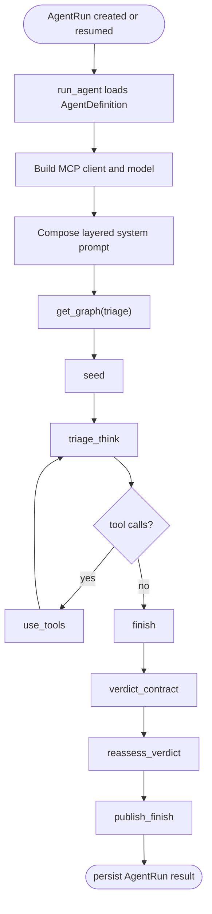
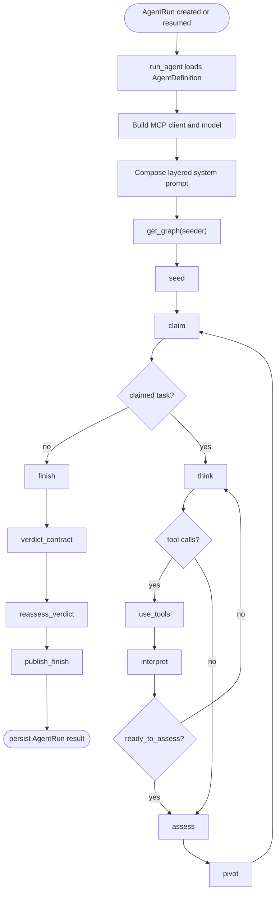

# Runtime & Agent Graph

## Runtime Entry

An agent run starts through either the REST API, the dashboard orchestrator, or a
workflow trigger. All specialist run paths converge on
`agent.runtime.engine.run.run_agent`, which:

1. loads the registered `AgentDefinition` by `agent_name`;
2. applies any DB-backed `AgentConfig` overrides;
3. marks the `AgentRun` as `running`;
4. builds an MCP client from the agent's deny-by-default `tool_policy`;
5. loads MCP prompt guidance and tool schemas;
6. builds the OpenAI-compatible model client;
7. composes the platform and agent prompt layers;
8. resolves the compiled LangGraph graph for `agent_name` via `get_graph(agent_name)` and invokes it with an `AgentState`.

The graph returns a final state with `status` and `final_answer`, which is then
persisted back to `AgentRun`.

The stable high-level runtime entry surfaces are:

- `run_orchestrator`
- `OrchestratorSession`
- `dispatch_run`
- `run_agent`
- `build_mcp_client`
- `compose_system_prompt`

The canonical orchestrator import surface is the package
`agent.runtime.orchestrator`. A flat compatibility module of the same name
re-exports the package's public names, so code importing the flat path resolves
to the same objects as code importing the package directly.

Model calls intentionally have no client-side request timeout by default. Local
vLLM/Ollama turns can run for a long time during tool-heavy investigations, so
`LLM_TIMEOUT` and `ModelProviderConfig.timeout` are opt-in positive-second
deadlines. Blank or `0` disables the timeout.

## Agent Registry

Agents are registered in `agent/agents/registry.py` using `AgentDefinition`
(`agent/agents/base.py`). Three agents are registered:

| Agent | Role | Tool Policy | Budget | Orchestrator-routable |
|---|---|---|---|---|
| `triage` | Reads SOAR case context, checks nearby SIEM evidence and memory, assesses severity/category, and returns a triage report with a prioritized investigation plan. | `aci-thehive`, `aci-wazuh`, `aci-taskqueue`, `aci-memory`, `avfs` | 16 steps, 40 tool calls | yes |
| `investigation` | Performs deeper SIEM-backed investigation, enriches artifacts, uses the findings board and memory, and produces a grounded final report. | `aci-thehive`, `aci-wazuh`, `aci-taskqueue`, `aci-board`, `aci-memory`, `avfs` | 40 steps, 60 tool calls | yes |
| `seeder` | Internal-only. Parses a completed triage report and populates the investigation task queue (see [Seeder Agent](#seeder-agent)). Never appears in orchestrator routing. | `aci-taskqueue` | 20 steps, 25 tool calls | no |

`triage` is marked as `produces_handoff`; `investigation` is marked as
`consumes_handoff`. The orchestrator uses those flags to pass structured
`Handoff` data through `AgentRun.metadata` instead of relying on prompt-string
parsing. `seeder` is invoked directly by the investigation agent's `seed`
node, not by the orchestrator.

## Agent Graph

Graph topology is now agent-scoped. Runtime resolves the graph by agent name
(`agent/runtime/graph/builder.py:get_graph`) and invokes one compiled graph per
agent type instead of a single shared `GRAPH` singleton.

| Module | Owns |
|---|---|
| `builder` | Per-agent graph resolver (`get_graph(agent_name)`) with cached compiled graphs. |
| `agent_graphs/triage.py` | Triage topology (`seed -> triage_think <-> use_tools -> finish -> verdict_contract -> reassess_verdict -> publish_finish`). |
| `agent_graphs/investigation.py` | Investigation topology (`seed -> claim -> think/use_tools/interpret/assess -> pivot -> claim`, then completion tail). |
| `agent_graphs/seeder.py` | Seeder topology equivalent to the prior non-triage routed path (`seed -> claim -> think/use_tools/interpret/assess -> pivot -> claim`, then completion tail). |
| `state` | The `AgentState` typed dict threaded through every node. |
| `nodes_loop` | Shared queue/tool-loop nodes (`seed`, `claim`, `think`, `use_tools`) plus post-tool enrichment (correlation, kill-chain, TI). |
| `interpretation/` | Investigation-only `interpret` implementation and ledger/pivot decision helpers. |
| `nodes_flow/` | Shared completion pipeline nodes (`finish`, `verdict_contract`, `reassess_verdict`, `publish_finish`) and investigation-specific `assess`/`pivot`. |
| `observation`, `toolio`, `validation`, `synthesis`, `reflection`, `findings_model`, `lead_model`, `parsing`, `sanitize`, `timeutil`, `board`, `leads` | Shared helper layers used across graphs and runtime/orchestrator imports. |

Active node responsibilities:

| Node | Used By | Responsibility |
|---|---|---|
| `seed` | triage, investigation, seeder | Initialize run context. Triage does not enqueue a queue task; it enters flat-loop reasoning directly. Investigation and seeder follow non-triage queue seeding behavior. |
| `claim` | investigation, seeder | Honor cancellation at boundary and claim highest-priority pending task from `aci-taskqueue`. |
| `triage_think` | triage | Flat-loop triage reasoning node; accumulates conversation, emits tool calls, and produces triage report text when complete. |
| `think` | investigation, seeder | Task-scoped reasoning loop using persistent per-task message history and transient steering. |
| `use_tools` | triage, investigation, seeder | Execute tool calls, cap oversized outputs, expand AVFS paths, extract artifacts, correlate entities, build kill-chain, trigger TI enrichment. |
| `interpret` | investigation, seeder | Mandatory post-tool checkpoint; updates ledger and decides continue-vs-assess. Evidence-floor veto is investigation-only. |
| `assess` | investigation, seeder | Produces/repairs task output, runs findings review, merges preserved findings, completes the claimed task. |
| `pivot` | investigation, seeder | Pushes validated findings to board, evaluates escalation cues, validates/queues new leads, returns to `claim` (seeder pivot behavior is effectively no-op for investigation-only actions). |
| `finish` | triage, investigation, seeder | Finalize run status (`completed`, `incomplete_budget`, or preserve `cancelled`). |
| `verdict_contract` | triage, investigation, seeder | Generates/repairs canonical fenced-JSON verdict from final report text. |
| `reassess_verdict` | triage, investigation, seeder | Performs verdict consistency reassessment before publish. |
| `publish_finish` | triage, investigation, seeder | Writes durable final outputs and persists terminal report artifacts. |

### Triage Graph

### Investigation Graph

### Seeder Graph

### Task Completion Contract

Every task stored with status `completed` must have a non-empty summary. When the
action model ends a task without text, `assess` performs one text-only recovery
call using the task conversation and tool results. The recovery prompt requires:

- work performed;
- key result or outcome;
- remaining uncertainty or blockers;
- relevant artifact paths or native event IDs.

If recovery also returns no text or fails, the runtime writes a deterministic
execution record derived from actual `ToolMessage` history. If there was no tool
activity, the record explicitly says that no findings or conclusion were
supplied. The taskqueue repository rejects direct blank completion summaries.

Investigation finalization reads these task summaries into the structured run
result, so the orchestrator can distinguish completed work, incomplete work, and
tasks that completed without a substantive conclusion.

### Per-Task Findings Review

Findings quality for `investigation` is classified by a single **per-task findings review**
(`agent/runtime/graph/reflection.py: review_task_model`) rather than a set of
narrow, independently hand-coded checks: one model call judges the task
holistically and returns a `TaskReview` (`conclude` or `keep_working`, plus
per-`## Findings` bullet grounding/novelty verdicts). This follows the design
philosophy's general preference for prompts and reusable workflow over
accumulating edge-case branching — see
[Architecture Overview](../overview.md#architectural-philosophy).

The review is given deterministic *signals* to ground its judgment, computed in
code rather than guessed by the model:

- `evidence_queries` — count of genuine evidence-retrieval tool calls this task;
- `hit_count` / `hit_ceiling` — whether the most recent search result is at or
  near the unusable result ceiling;
- `unpivoted_iocs` — confirmed network indicators with no corresponding
  `## New Leads` pivot;
- `unqueried_clusters` — `get_event_volume` post-peak activity windows that
  were profiled but never followed up with a raw query;
- `unreported_compromise_artifacts` — confirmed compromise indicators already
  on the Findings Board (e.g. a decoded reverse-shell command) that are not
  yet reflected in this task's `## Findings`.

The review's `keep_working` vote is **deliberately ignored**. Completion is
`interpret`'s decision alone — the review used to be able to overturn it and
route back to `think`, which meant two model calls answering one question. What
survives is its per-finding classification, which `pivot` consumes for board
gating (`last_findings_verification`). The review is fail-open: if the model is
unavailable or the call fails, the task falls back to the deterministic
non-empty-summary check and completes rather than stalling the run.

The one deterministic backstop that remains is the **evidence floor**, now a
routing predicate in `_route_interpret` rather than a retry loop in `assess`: a
task whose completion vote arrives with zero evidence queries is sent back to
`think`. It can only veto a completion decision, never initiate one.

### Seeder Agent

A normal triage-handoff seed (i.e. not a resume) populates the investigation
queue through the dedicated `seeder` agent (`agent/runtime/engine/seeder_runner.py:
run_seeder`) instead of asking the investigation model to call `create_task`
directly. Seeding is two-phase:

1. **Deterministic extraction.** Plan items are parsed straight out of the
   triage report's `## Investigation Plan` and written with direct
   `create_task` calls — no model involvement. This guarantees exactly one
   task per plan item regardless of model behavior.
2. **Model pass for gaps.** A bounded second pass lets the model add tasks the
   plan may have omitted (e.g. an explicit C2-destination pivot or
   initial-access-vector task) and verify completeness via `list_tasks`.
   Every `create_task` call in this pass — direct or model-proposed — is
   checked against a **deterministic dedup backstop**
   (`agent/runtime/graph/leads.py: duplicate_existing_task`, the same matcher
   the pivot node's lead validator uses) before it is executed, so the model
   cannot queue two near-identical tasks in the same seeding pass.

`seeder` is `orchestrator_routable=False`: it never appears in orchestrator
routing and is only ever invoked from `seed`.

## Status And Failure Handling

The runtime persists one of the fixed `AgentRun` statuses:

| Status | Meaning |
|---|---|
| `created` | Run row exists but has not been queued. |
| `queued` | Run accepted and worker/thread dispatch requested. |
| `running` | Graph execution is active. |
| `waiting` | Reserved for future human/external waits. |
| `completed` | Queue emptied and finalization succeeded. |
| `incomplete_budget` | Step or tool-call budget exhausted before normal completion. |
| `cancelled` | Cancellation was requested and honored at a claim boundary. |
| `blocked` | Reserved for no executable work or external dependency blocking. |
| `failed` | Runtime or tool setup raised an unrecoverable exception. |

Known vLLM harmony-control-token leakage is handled by sanitizing assistant
messages before they re-enter history. If vLLM still reports an unexpected
message-header parse failure, `think` retries once with more aggressive history
sanitization.
